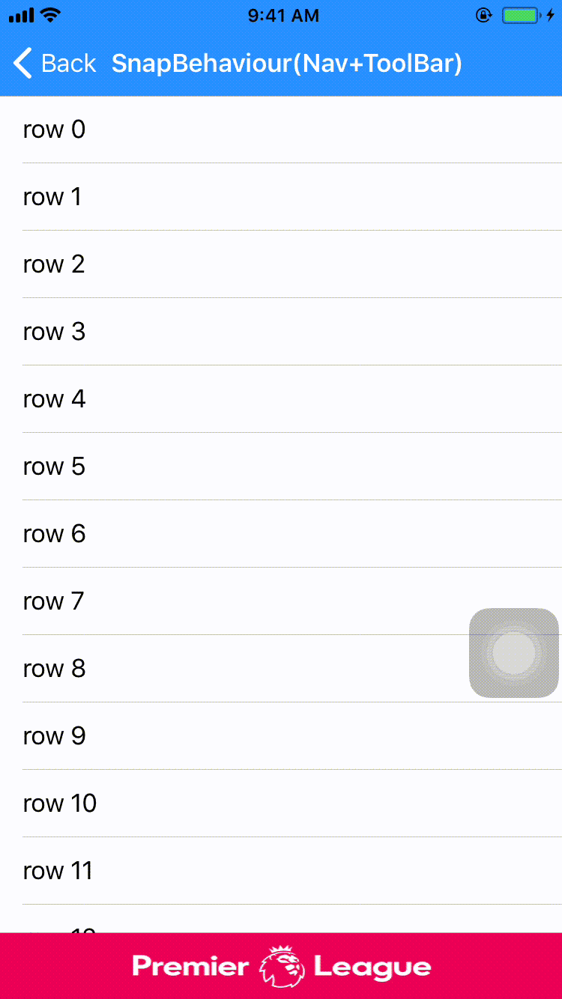

# ScrollCoordinator

[](http://cocoapods.org/pods/ScrollCoordinator)
[](http://cocoapods.org/pods/ScrollCoordinator)
[](http://cocoapods.org/pods/ScrollCoordinator)

## Example

To run the example project, clone the repo, and run `pod install` from the Example directory first.

## Requirements

## Installation

ScrollCoordinator is available through [CocoaPods](http://cocoapods.org). To install
it, simply add the following line to your Podfile:

```ruby
pod 'ScrollCoordinator'
```
## Screenshots

Hiding the NavigationBar and ToolBar
.gif?v=4&s=100)


Hiding the NavigationBar and TabBar
.gif?v=4&s=50)

Anchoring the ScrollView


## Usage

For the usage make your view controller conform to the ScrollCoordinatorManager protocol. The scrollCoordinator needs to be initialised if you are planning to use it. You can have your custom logic of when you want/need to initialise this. The implementation here describes the minimal content within the methods. You could have your custom logic and perform further operation if you want to, but passing these events on to the scroll coordinator is a must.

~~~swift
//Implement the ScrollCoordinatorManager in your view controller
class YourViewController: UIViewController, ScrollCoordinatorManager {
//Variable of ScrollCoordinatorManager protocol
var scrollCoordinator: ScrollCoordinator?

/*
Methods of ScrollCoordinatorManager protocol
*/
func getScrollCoordinatorLayout() -> ScrollCoordinator? {
return scrollCoordinator
}

func addBehaviour(view: UIView, behaviour: Behaviour) {
scrollCoordinator?.addBehaviour(view: view, behaviour: behaviour)
}

func removeBehaviour(view: UIView) {
scrollCoordinator?.removeBehaviour(view: view)
}

func registerScrollViewToCoordinator(scrollView: UIScrollView) {
scrollCoordinator?.registerScrollView(scrollView: scrollView)
}

func informCoordinatorVCWillAppear() {
scrollCoordinator?.vcWillAppear()
}

func informCoordinatorVCWillDisappear() {
scrollCoordinator?.vcWillDisappear()
}

func informCoordinatorVCDidSublayoutViews() {
scrollCoordinator?.vcDidSublayoutViews()
}
}
~~~

All the scrollviews for which you need the gesture and scroll events need to be registered to the VC implementing the scrollCoordinator manager. This is the method implemented by YourViewController in the above example
~~~swift
registerScrollViewToCoordinator(scrollView: tableView)
~~~

Similarly all the behaviours which you want need to be added to the VC implementing the scrollCoordinator manager. This is again method implemented by YourViewController. Note that NavBarSnapBehaviour is not supported in nested scroll views
~~~swift
//Adding NavBarSnapBehaviour
if (navigationController != nil || navigationController?.navigationBar != nil) {
if let navController = navigationController {
self.extendedLayoutIncludesOpaqueBars = true //this needs to be done
addBehaviour(view: navController.navigationBar, behaviour: NavbarSnapBehaviour(snapDirection: .TOP, navController: navController, scrollView: tableView, refreshControl: nil, snapDelegate: nil))
}
}

//Adding the SnapBehaviour to the bottom bar
if let bottomBar = navigationController?.tabBarController?.tabBar {
addBehaviour(view: bottomBar, behaviour: SnapBehaviour(snapDirection: .BOTTOM, view: bottomBar, refreshControl: nil, snapDelegate: nil))
}

//Adding the AnchorBehaviour
if isAnchorBehaviourEnabled {
tableView.isScrollEnabled = false //this needs to be disabled to allow the behaviour to scroll the view
let anchorHeight: CGFloat = 60 //this is the height where the scroll will be anchored
addBehaviour(view: tableView, behaviour: AnchorBehaviour(scrollView: tableView, anchorHeight: anchorHeight, shouldPreventOriginalScroll: true))
}
~~~

For making your  own custom behaviour you must conform to the Behaviour protocol.
~~~swift
class PercentageBehaviour: Behaviour {
//This variable determines whether you would receive the scroll events after gesture ends. If you want to listen only to the gestures keep this false. Otherwise you can make this true.
var needsPostGestureInfo: Bool = true

//You will receive all the gestures with the relevant info from the scroll
func handleGestureFromDependantScroll(gestureInfo: PanGestureInformation, scrollTranslationInfo: ScrollTranslationInformation) {
}

//If your behaviour needs to respond to only a single scroll view you can return that as the dependant scrollview. Then you would only receive events from that scrollview
func getDependantScrollView() -> UIScrollView? {
}

//Your behaviour will receive this when a new gesture starts
func gestureDidStart(scrollView: UIScrollView) {
}

//Your behaviour will receive this when the gesture ends
func gestureDidFinish(gestureInfo: PanGestureInformation, scrollView: UIScrollView) {
}

//These are scroll events after the gesture has finished but the scrollview is still scrolling
public func scrollDidTranslateAfterGesture(scrollTranslationInfo: ScrollTranslationInformation) {
}

//These are vc level events
func vcWillAppear() {
}

func vcWillDisappear() {
}

func vcDidSubLayoutViews() {
}


}
~~~

## Author

[shubhankaryash](https://github.com/shubhankaryash) and [manishPatwari](https://github.com/manishPatwari)

## License

ScrollCoordinator is available under the MIT license. See the LICENSE file for more info.
